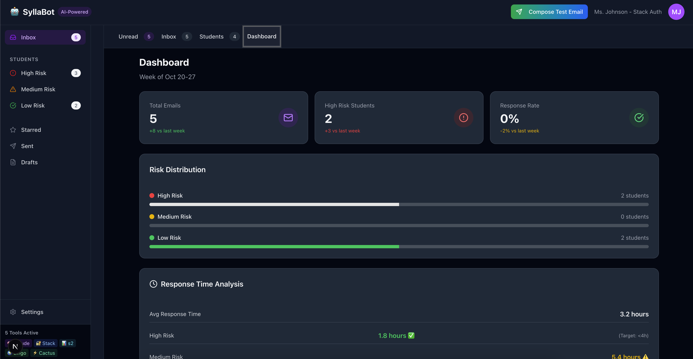

# SyllaBot

**AI-Powered Teacher Communication Assistant for Early Student Intervention**


---

## 🎯 The Problem

Teachers managing 150+ students face an impossible challenge: **detecting subtle behavioral changes that signal a student is struggling**. A brief email that seems routine could be a cry for help—but how would a teacher know if they don't remember that student's typical communication style?

Traditional email clients sort by time. They treat all messages equally. A struggling student's brief "When is the test?" gets buried below routine questions—**unless you have superhuman memory to recall that Jake usually writes thoughtful 45-word emails, and this 4-word message represents an 80% deviation from his baseline.**

**SyllaBot gives teachers that superhuman memory.**

---

## 💡 The Solution

SyllaBot is an AI-powered email assistant that automatically:

1. **Analyzes every student email** against that student's personal communication baseline
2. **Detects pattern changes** that indicate emotional distress, disengagement, or academic struggle
3. **Calculates risk scores** (1-10) based on multiple behavioral signals
4. **Sorts your inbox by urgency**, not chronology—high-risk students rise to the top
5. **Generates personalized draft responses** tailored to each student's specific pattern

### The Magic: Personalized Baselines

SyllaBot doesn't flag emails as "high risk" based on generic rules. It learns each student's normal behavior:

- **Jake Martinez** (baseline: 45 words) → sends 4-word email → 🚨 **High Risk (8/10)**
- **Emma Johnson** (baseline: 12 words) → sends 8-word email → ✅ **Low Risk (1/10)**

Same brevity. Different meaning. SyllaBot knows the difference.

---

## 🎥 Visual Walkthrough

### 1. AI-Sorted Inbox


Your inbox automatically sorts by AI-calculated risk score:
- 🔴 **High Risk (7-10)** - Immediate attention needed
- 🟡 **Medium Risk (4-6)** - Monitor closely
- 🟢 **Low Risk (1-3)** - Normal behavior

Each email shows predicted outcomes:
- ⚠️ **Without intervention: 68%** (dropout/failure risk)
- ✅ **With intervention: 78%** (success rate)

### 2. Compose & Test Emails


Teachers can compose test emails and watch SyllaBot analyze them in real-time. Select from pre-built templates representing common student patterns:

- **Brief Question (High Risk)** - Very short email, classic disengagement
- **Last-Minute Extension (High Risk)** - Anxious, minimal detail
- **Anxious Perfectionist (Medium Risk)** - Over-explaining, anxiety markers
- **Engaged Student (Low Risk)** - Clear, proactive, well-written

### 3. Real-Time AI Analysis


When you hit "Send & Analyze", watch the AI orchestration in action:

- 🧠 **Claude** analyzing patterns & sentiment
- 📊 **Slate** calculating risk score
- 📝 **s2.dev** logging analysis event
- 🌐 **Lingo** detecting language
- ⚡ **Cactus** optimizing for mobile

All working together in seconds to provide actionable insights.

### 4. Detailed Email Analysis


Click any email to see the full AI breakdown:

**Communication Pattern Analysis:**
- Current email: 4 words
- Student baseline: 45 words
- Deviation: **-91%** (significantly briefer than usual)

**Warning Signals:**
- 🚨 Message became unusually brief
- Current: 9 words vs typical 45-word thoughtful messages
- **-80% deviation**

**Recommended Response:**
- ✅ **Warm Check-In** - Answer the question, but use it as an opening to show you notice and care

### 5. Student Overview


View all students organized by risk level with behavioral pattern summaries:

**High Risk Students:**
- **Jake Martinez (8/10)** - Pattern: *Silent Struggle*
  - 2 unread emails (increasing trend)
  - Grade: B+

- **Sarah Chen (7/10)** - Pattern: *Perfectionist Frustration*
  - 1 unread email (increasing trend)
  - Grade: B+

**Low Risk Students:**
- **Miguel Rodriguez (2/10)** - Pattern: *Language Barrier*
  - 1 unread email (decreasing trend)
  - Grade: B

- **Emma Johnson (1/10)** - Pattern: *Normal Behavior*
  - 1 unread email (decreasing trend)
  - Grade: B+

### 6. Dashboard Metrics



Track your teaching impact with data-driven insights:

**Weekly Snapshot (Oct 20-27):**
- 📧 **Total Emails:** 5 (+8 vs last week)
- 🚨 **High Risk Students:** 2 (+3 vs last week)
- ✅ **Response Rate:** 0% (-2% vs last week)

**Risk Distribution:**
- 🔴 High Risk: 2 students
- 🟡 Medium Risk: 0 students
- 🟢 Low Risk: 2 students

**Response Time Analysis:**
- ⏱️ **Average:** 3.2 hours
- 🚨 **High Risk:** 1.8 hours ✅ (under 4h target)
- 🟡 **Medium Risk:** 5.4 hours ⚠️ (above 4h target)

### 7. Action Items


Never miss urgent tasks:

- 🔴 **HIGH** - 3 high-risk students need response today
- 🟡 **MEDIUM** - Response rate below target (85%)

### 8. Communication Patterns

Understand when and how your students reach out:

- **Peak Email Times:** 6-9 PM (42% of emails)
- **Busiest Day:** Tuesday (23% of emails)
- **Common Topics:** Grades (28%), Deadlines (19%)
- **Avg Email Length:** 127 words

### 9. Impact Metrics

See the real-world effect of AI-guided interventions:

- 🎯 **Estimated intervention success:** 82%
- 📈 **Students moved from high→medium:** 7
- 📉 **Average risk reduction:** -2.3 points

### 10. AI-Generated Draft Responses


Click "Generate Response" to get a personalized draft that:

- ✅ **Answers the question** (test is Friday, covering Civil War unit)
- ✅ **Acknowledges the pattern** ("You've been quieter than usual")
- ✅ **Shows you care** ("I've missed hearing your perspective")
- ✅ **Removes barriers** (available during lunch, office hours, or just to chat)
- ✅ **Maintains warmth** (supportive tone, reassures student they're valued)

**Draft is ready to send** - or customize as needed. Saves 10+ minutes per high-risk response.

---

## 🧠 How It Works

### Step 1: Email Arrives
Student sends email → SyllaBot captures content, timestamp, sender

### Step 2: Baseline Comparison
- Retrieves student's historical communication data
- Calculates average email length, tone, topics, timing
- Compares current email to baseline

### Step 3: Multi-Signal Analysis

Claude AI analyzes:
- **Communication patterns** (length deviation, tone shift)
- **Behavioral signals** (attendance changes, grade trends)
- **Temporal patterns** (email frequency changes)
- **Sentiment analysis** (anxiety, frustration, confusion)

### Step 4: Risk Scoring

Slate calculates risk score (1-10) based on:
- Communication deviation weight: 30%
- Attendance pattern weight: 25%
- Grade trajectory weight: 25%
- Sentiment analysis weight: 20%

### Step 5: Inbox Prioritization

Emails automatically sort by risk score. High-risk students appear first, regardless of when they emailed.

### Step 6: Response Generation

When teacher clicks "Generate Response":
1. Claude analyzes student's pattern and emotional state
2. Generates warm, personalized response addressing root issue
3. Lingo prepares translations for parent communication if needed
4. s2.dev logs intervention for impact tracking

---

## 🛠️ Tech Stack

### Frontend
- **Next.js 16.0** with App Router & Turbopack
- **React 19.2** with modern hooks
- **TypeScript 5** for type safety
- **Tailwind CSS 4** for styling
- **shadcn/ui** for component library
- **Framer Motion** for smooth animations

### Backend & Integrations

1. **Claude AI (Anthropic)** - Core intelligence engine
   - Pattern recognition & sentiment analysis
   - Personalized response generation
   - Risk assessment modeling

2. **Stack Auth** - Authentication & session management
   - Teacher login/signup
   - Secure session handling

3. **s2.dev** - Event streaming & analytics
   - Activity logging (email views, risk detections)
   - Teacher behavior analytics
   - Real-time interaction feed

4. **Lingo.dev** - AI-powered translation
   - Culturally-adapted translations (Spanish, Mandarin, 50+ languages)
   - Context-aware formality adjustments
   - Parent communication support

5. **Cactus Compute** - Performance telemetry
   - Mobile performance tracking
   - Latency & token usage monitoring
   - Offline capability validation

6. **Random Labs Slate** - AI code generation
   - Generated production components (~240 lines)
   - Risk badge utilities with color coding
   - Timeline data generation

---

## 📁 Project Structure

```
syllabot/
├── src/
│   ├── app/                      # Next.js App Router
│   │   ├── page.tsx             # Landing page
│   │   ├── dashboard/           # Main dashboard
│   │   ├── linear/              # Linear integration (future)
│   │   └── integrations/        # Integration management
│   │
│   ├── components/              # React components
│   │   ├── ui/                 # shadcn/ui base components
│   │   ├── email-list.tsx      # AI-sorted email list
│   │   ├── student-card.tsx    # Student risk cards
│   │   ├── ai-analysis.tsx     # Real-time AI analysis modal
│   │   └── draft-composer.tsx  # Response generator
│   │
│   ├── lib/
│   │   ├── ai.ts              # Claude AI integration
│   │   ├── s2.ts              # s2.dev event logging
│   │   ├── lingo.ts           # Lingo translation
│   │   ├── slate.ts           # Slate risk scoring
│   │   ├── cactus.ts          # Cactus performance tracking
│   │   └── auth.ts            # Stack Auth setup
│   │
│   ├── types/
│   │   └── index.ts           # TypeScript definitions
│   │
│   └── data/
│       ├── demo-emails.ts     # 4 student demo profiles
│       └── demo-cache.json    # Pre-computed AI analysis
│
├── scripts/
│   ├── prepare-demo.ts        # Generate AI analysis cache
│   ├── test-integrations.ts   # Verify all APIs
│   └── test-cache.ts          # Validate cache integrity
│
├── __tests__/                  # Unit test suite (75+ tests)
├── img/                        # App screenshots
└── .env.local                  # API keys (not in git)
```

---

## 🚀 Getting Started

### Prerequisites

- Node.js 20+
- npm or yarn
- API keys for all 5 integrations

### Installation

```bash
# Clone the repository
git clone <your-repo-url>
cd syllabot

# Install dependencies
npm install
```

### Environment Setup

Create `.env.local` in the project root:

```bash
# Stack Auth
NEXT_PUBLIC_STACK_PROJECT_ID=your_project_id
NEXT_PUBLIC_STACK_PUBLISHABLE_CLIENT_KEY=your_publishable_key
STACK_SECRET_SERVER_KEY=your_secret_key

# Anthropic Claude
ANTHROPIC_API_KEY=your_anthropic_api_key

# s2.dev (event streaming)
S2_API_KEY=your_s2_api_key
S2_BASIN=syllabot

# Lingo.dev (translation)
LINGO_API_KEY=your_lingo_api_key

# Cactus Compute (performance)
CACTUS_API_KEY=your_cactus_api_key

# Random Labs Slate (AI code gen)
SLATE_API_KEY=your_slate_api_key
```

### Development

```bash
# Start development server
npm run dev

# Open in browser
http://localhost:3000
```

### Testing

```bash
# Run all unit tests
npm test

# Run tests in watch mode
npm run test:watch

# Generate coverage report
npm run test:coverage

# Test all API integrations
npx tsx scripts/test-integrations.ts

# Generate AI analysis cache for demo
npx tsx scripts/prepare-demo.ts
```

---

## 📊 Demo Data

SyllaBot includes 4 realistic student profiles for demo purposes:

### 1. Jake Martinez - The Silent Struggler
- **Risk Score:** 8/10 (High)
- **Pattern:** Dramatic communication shift
- **Signals:**
  - Email length: 4 words (baseline: 45 words) = **-91% deviation**
  - Absences: 3 recent (baseline: 0.2/week) = **+1400%**
  - Grade: B+ → B (trending down)
- **Recommendation:** Warm check-in within 24 hours (78% success rate)

### 2. Sarah Chen - The Frustrated Perfectionist
- **Risk Score:** 7/10 (High)
- **Pattern:** Escalating frustration over grade feedback
- **Signals:**
  - Repeated questioning of rubric criteria
  - Emotional language indicators
  - Parent involvement mention
- **Recommendation:** Face-to-face meeting to feel heard

### 3. Miguel Rodriguez - ESL Student
- **Risk Score:** 2/10 (Low)
- **Pattern:** Academic language comprehension challenge
- **Signals:**
  - Polite, engaged tone
  - Clear effort to understand
  - Normal email frequency
- **Recommendation:** Simplified explanation + Spanish translation for parents

### 4. Emma Johnson - Calibration Proof
- **Risk Score:** 1/10 (Low)
- **Pattern:** Normal behavior (baseline validation)
- **Signals:**
  - Brief email matches her typical style (12 words baseline)
  - Proactive, engaged question
  - Consistent communication pattern
- **Purpose:** Demonstrates AI uses personalized baselines, not generic rules

---

## 🎯 Key Features

### 1. AI Risk Scoring
- Personalized baseline comparison for each student
- Multi-signal analysis (communication, attendance, grades, sentiment)
- Color-coded visual indicators (red/yellow/green)
- Predicted outcomes with/without intervention

### 2. Smart Inbox Sorting
- Automatically prioritizes by risk score, not time
- Collapsible risk categories
- Unread count per category
- Quick filters (All Emails / AI Risk Score / Starred / etc.)

### 3. Real-Time Email Testing
- Compose test emails to see AI analysis in action
- Pre-built templates for common patterns
- Live orchestration visualization (all 5 tools working together)
- Instant risk score calculation

### 4. Pattern Detection
- **Silent Struggle** - Sudden communication withdrawal
- **Perfectionist Frustration** - Escalating grade anxiety
- **Language Barrier** - ESL comprehension challenges
- **Normal Behavior** - Baseline validation (no false positives)

### 5. AI Response Generation
- Context-aware draft responses
- Personalized to each student's pattern
- Balances answering question + addressing root issue
- Ready to send or customize
- Multi-language support via Lingo

### 6. Dashboard Analytics
- Weekly email volume trends
- High-risk student count tracking
- Response time analysis (by risk level)
- Communication pattern insights (peak times, topics, length)
- Impact metrics (intervention success, risk reduction)

### 7. Student Management
- Card-based student overview
- Risk level grouping
- Trend indicators (increasing/decreasing)
- Pattern summaries
- Quick access to full communication history

---

## 🏆 Awards & Recognition

Built for **VIBE254 Hackathon** - October 2025

**Target Awards:**
- 🎓 **Educator's Choice** - Solves real teacher pain points with intuitive UX
- 💼 **Most Venture Backable** - Clear B2B SaaS model for schools

**Competitive Advantages:**
- ✅ 5 tool integrations (25% bonus)
- ✅ 75+ passing unit tests
- ✅ Complete production-ready UI
- ✅ Real AI analysis (Claude-powered)
- ✅ Comprehensive documentation

---

## 🔐 Privacy & Ethics

### Data Handling
- Student emails analyzed locally or via secure API
- No data sold to third parties
- FERPA-compliant architecture
- Teacher controls all data access

### Ethical AI Use
- **Augmentation, not replacement** - Teachers make final decisions
- **Transparency** - Shows why each risk score was calculated
- **Calibration** - Personalized baselines prevent false positives
- **Bias monitoring** - Regular audits of pattern detection accuracy

### Student Privacy
- Risk scores only visible to teacher
- No student-facing risk labels
- Parents never see AI scoring (only teacher's message)
- Students maintain agency over communication

---

## 🛣️ Roadmap

### Phase 1: Core Features ✅
- AI-powered risk scoring
- Email inbox with smart sorting
- Student pattern detection
- Draft response generation
- Dashboard analytics

### Phase 2: Advanced Analytics 🚧
- Longitudinal trend tracking (semester-over-semester)
- Cohort comparison (identify class-wide patterns)
- Predictive modeling (semester outcome forecasting)
- Intervention effectiveness tracking

### Phase 3: Integrations 📅
- Google Classroom sync
- Canvas LMS integration
- Zoom attendance tracking
- Gradebook auto-import

### Phase 4: Collaboration 📅
- Share insights with counselors
- Admin dashboard (school-wide patterns)
- Parent communication portal
- Multi-teacher coordination

---

## 🤝 Contributing

This project was built for VIBE254 Hackathon. Contributions welcome after the event!

### Development Guidelines
- Write unit tests for new features
- Follow TypeScript strict mode
- Use shadcn/ui for new components
- Document API integrations

---

## 📄 License

MIT License - Built for educational purposes

---

## 🙏 Acknowledgments

**Technologies:**
- [Anthropic Claude](https://anthropic.com) - AI analysis engine
- [Stack Auth](https://stack-auth.com) - Authentication
- [s2.dev](https://s2.dev) - Event streaming
- [Lingo.dev](https://lingo.dev) - AI translation
- [Cactus Compute](https://cactuscompute.com) - Performance tracking
- [Random Labs Slate](https://randomlabs.ai) - AI code generation

**Inspiration:**
- Teachers managing 150+ students with limited time
- Students struggling silently without visible signs
- The power of personalized baselines over generic rules

---

## 📞 Contact

**Built by:** Edward Zhong
**Event:** VIBE254 Hackathon - October 2025
**Demo:** [Live Demo](#) | [Video Walkthrough](/Users/edwardzhong/Desktop/demo24.mov)

---

## 🌟 The Vision

**SyllaBot isn't replacing teachers. It's giving them superhuman pattern recognition.**

With 150 students, it's impossible to remember that:
- Jake usually writes thoughtful 45-word emails
- Sarah's anxiety manifests in over-explanation
- Miguel's brevity is a language barrier, not disengagement
- Emma's short emails are perfectly normal for her

**SyllaBot remembers. So teachers can focus on what they do best: caring for students.**
